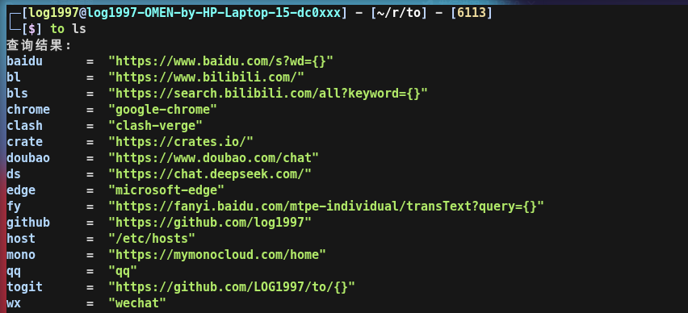

# to: 你的快捷命令管理器

[使用rust构建] 配置你的快捷命令，在命令行快速的打开网页、应用、文件夹或者文件。

## 适用平台

Windows、Linux[Ubuntu]

## 命令说明

### 1. 添加

  向配置文件中添加命令

  to add [cmd_name] [cmd_value]

  比如: `to add github https://github.com`、`to add host /etc/hosts`,如果我想快捷打开翻译，以百度翻译为例，可以这样配置`to add fy https://fanyi.baidu.com/mtpe-individual/transText\?query\=\{\}`，执行`to fy dangerous`，就可以在网页查看翻译

### 2. 删除

  从配置文件中删除指定命令

  to del [cmd_name]

  比如: `to del github`

### 3. 列表

  打印出所有配置好的命令列表

  to ls

### 4. 查找

  查找命令，会从name和value中查找

  to search [params]

  比如: `to search github`

### 5. 编辑配置文件

  使用系统默认应用直接打开配置文件，如果想要使用vim打开，请在后面添加`--vim`参数

  to edit

  比如: `to edit`、`to edit --vim`

### 6. 该软件的信息

  to about

## 使用

本应用无需安装，只需要保证在任何地方输入命令(to)可以被执行即可。

### linux

  最佳方式是创建软链接的形式:

  `sudo ln -s /[your path]/to /usr/local/bin/to`

  然后重新登录系统

### windows

  使用windows的环境变量，在环境变量配置的文件夹，可以在任何地方执行其中的软件

  最简单的方式是，把`to`放到`C:\Windows\System32`中：

  `New-Item -ItemType SymbolicLink -Path "C:\Windows\System32\to.exe" -Target "D:\[your path]\to.exe"`

## 备注

运行该命令会在用户文件夹下创建一个配置文件`config.toml`，路径为`~/.config/to/config.toml`
